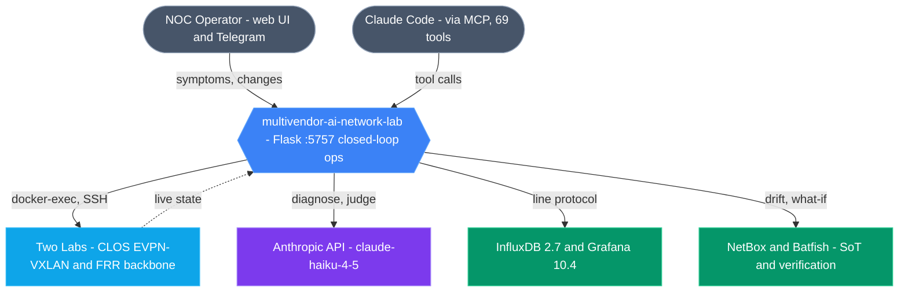

<p align="center"></p>

# Multivendor AI Network Lab

## 📖 Live documentation

[](https://gesh75.github.io/multivendor-ai-network-lab/)

> 🌐 **Live:** <https://gesh75.github.io/multivendor-ai-network-lab/> — an animated single-page guide: architecture diagrams, data flow, tech stack, and quickstart.
>
> 🗂️ Part of the **[gesh75 documentation hub](https://gesh75.github.io/)** — all my network & AI engineering project docs in one place.

## 🖥️ Fabric operations portal

[](https://gesh75.github.io/multivendor-ai-network-lab/portal.html)

> 🌐 **[Open the live portal →](https://gesh75.github.io/multivendor-ai-network-lab/portal.html)** — GESH Lab Ops: interactive topology, fleet, 6-stage pipeline, Phase-6 auto-remediate queue, CLI RAG, MCP catalog, NetBox drift, and GAIT. Honest inventory is baked in (19 live net · 69 MCP tools · v0.6.0). The old `FABRIC` badge polled `127.0.0.1:5757` and read `FABRIC ?` on the public web; the portal no longer depends on a local Flask backend.
>
> 🛠️ **Build it yourself:** the step-by-step **[Build Your Own Docker Lab](docs/BUILD_YOUR_OWN_LAB.md)** guide (macOS & Linux) stands the whole fabric up — `docker-compose` FRR backbone + the containerlab EVPN fabric, with the `--pid host` recipe and image setup.


> **⚡ Phase 6 (Jun 2026) — event-initiated remediation:** detected anomalies now
> auto-trigger the closed-loop change pipeline, **risk-gated** — LOW auto-executes,
> MEDIUM/HIGH queue for one-click approval, CRITICAL pages out and **never auto-acts**.
> Blast-radius BFS tier escalation · confirmed-commit (RFC 6241 §8.4) auto-revert ·
> 8-runbook catalog · 6 endpoints · auto-remediation queue UI · 5 new MCP tools
> (**~68 total**) · **34/34 tests**. Release:
> [**v0.6.0**](https://github.com/gesh75/multivendor-ai-network-lab/releases/tag/v0.6.0).
>
> **🎯 Phase 5 (May 2026) — COMPLETE:** RAG · gNMI streaming (SRL) · ADTK anomaly
> detection · 6-stage closed-loop pipeline · predictive forecast · 68 MCP tools ·
> **41 PASS / 0 FAIL** stress test.
>
> **🛰 Phase 4 (May 2026) — the closed-loop phase:** Health Gate (RFC 6241 §8.4
> confirmed-commit) · NetBox SoT drift detector · Auto-Remediate proposal state
> machine · Auto-Postmortem markdown writer · 9,802-command CLI BM25 retrieval ·
> MCP layer extended to 49 tools (12 Phase-4 closed-loop). The lab now takes an
> action *and takes it back* if any signal degrades during the watch window.
>
> Demo: [`demo/linkedin-demo.mp4`](demo/linkedin-demo.mp4) (0:52 · 1280×720) ·
> [`demo/LINKEDIN_POST.md`](demo/LINKEDIN_POST.md) · full feature map in
> [`FEATURES.md`](FEATURES.md).
>
> **🛡 2026-05-25 audit hardening:** end-to-end functional audit closed 9 of 11
> gaps in one session. Tool now reports honestly against the live 25-device
> deployment: **19 network devices · 5 sites · 41/41 clab BGP up · 0 console
> errors · 20/20 endpoints green**. Collector under launchd KeepAlive, KPI
> strip wired to live counts, gnmic freshness uses `source`-tag filter.
> Full audit: [`GAPS_REPORT.md`](GAPS_REPORT.md) · post-audit architecture:
> [`docs/ARCHITECTURE_HARDENED.md`](docs/ARCHITECTURE_HARDENED.md).
>
> **🔁 2026-05-25 closed-loop pipeline (roadmap #4):** new
> `POST /api/change/closed-loop` chains **6 stages** — Predict → Batfish →
> Apply (Health Gate) → Watch → POST diff → Intent verify — into a single
> governed operation with auto-rollback. Verified live: **APPROVED in 12s**,
> **ROLLED_BACK in 6s** on induced regression. Pushes the tool from
> TM Forum ANL **L2 → L3**. Design + sequence: [`docs/CHANGE_PIPELINE.md`](docs/CHANGE_PIPELINE.md).
>
> **🩺 2026-05-25 round-2 audit + #3 ADTK:** every previously-broken tab now
> functional on **both fabrics** for **all 4 vendor families** (Juniper / Arista
> EOS / Nokia SR Linux / FRR). NAPALM endpoints return real data (60 clab + 18
> DCN peers); Nornir LLDP / Config Compliance work; Shadow Auditor reads live
> running-config via docker exec; Chaos Monkey targets both fabrics; Postmortem
> + AI Insights have fabric/device selectors. New `/api/anomaly/detect`
> endpoint runs Z-score + flap-count detectors over the live time series and
> merges findings into `/api/keep/correlate`. Full evidence:
> [`docs/POST_AUDIT_FIXES_2.md`](docs/POST_AUDIT_FIXES_2.md).
>
> **🎯 2026-05-25 Phase 5 COMPLETE:** all 5 roadmap items shipped (#1 RAG, #2
> gNMI for SRL, #3 ADTK, #4 closed-loop, #5 predictive forecast) plus 13 new
> MCP tools (63 total), persistent docker-exec session pool, and cEOS+FRR
> streaming migration script. **Stress test: 41 PASS / 0 FAIL** across every
> feature × every fabric × every vendor. Post-Phase-5 architecture +
> Phase-6 backlog: [`docs/ARCHITECTURE_PHASE_5.md`](docs/ARCHITECTURE_PHASE_5.md) ·
> agent handoff: [`docs/PHASE_5_HANDOFF.md`](docs/PHASE_5_HANDOFF.md).

A 26-device multivendor (Juniper / Arista / FRR) network operations lab driven
by a Pydantic-AI orchestrator, eval harness, and immutable AI audit trail.

Built as a working reference implementation of patterns from
[NetClaw](https://github.com/automateyournetwork/netclaw),
[NIKA](https://github.com/sands-lab/nika),
[pydantic-ai](https://medium.com/@hugotinoco/developing-a-network-automation-ai-agent-with-pydantic-ai-openrouter-e67d3ecc8570),
and [coding-networks-blog MCP+MPLS](https://codingnetworks.blog/en/ai-operating-mpls-network-i-connected-claude-to-my-network-using-mcp/) — all
adapted to be **vendor-agnostic** across Juniper JunOS, Arista EOS, FRR, with
hooks for Cisco IOS-XE / NX-OS.

## What's in here

| Capability | Where | Source pattern |
|---|---|---|
| 🤖 **Pydantic-AI orchestrator** with structured outputs (Routing / ACL / Incident agents) | `src/pydantic_ai_orchestrator.py` | Hugo Tinoco |
| 🧪 **Eval harness** — 10 incident scenarios, keyword + LLM-as-judge scoring | `src/eval_harness.py`, `src/scenarios.json` | NIKA |
| 📜 **GAIT immutable audit trail** — every AI action JSONL with token cost | `src/gait_audit.py` | NetClaw |
| 🛣️ **Hop-by-hop path trace** — vendor-colored SVG with BFS over BGP graph | `src/multivendor_extensions.py` `/api/mv/path/trace` | NetClaw |
| 🎯 **Intent verification** — config-claimed vs SuzieQ-observed drift detector | `src/multivendor_extensions.py` `/api/mv/intent/verify` | NetClaw |
| 🗺️ **Vendor-agnostic command translator** — 12 canonical tasks × 5 vendors | `src/vendor_translator.py` | new |
| 📦 **TOON serializer** — ~60% smaller than JSON for tabular API payloads | `src/toon_serializer.py` | NetClaw |
| 🛡️ **Auto-remediation runbooks** — YAML playbooks (BGP/OSPF/Interface/ACL) | `src/runbooks/` | NetClaw |
| 🔍 **CVE scanner** — static `(vendor, OS version)` lookup over fleet | `src/cve_db.json`, `/api/mv/cve` | NetClaw |
| ⚙️ **MCP server** — 69 tools so Claude Code can call any capability | `src/mcp_dcn_server.py` | coding-networks-blog |
| 🩺 **Single-device health snapshot** — `GET /api/health/<hostname>` → one JSON doc with BGP/OSPF/interfaces/routes/mem/CPU in parallel | `src/health.py`, [`docs/HEALTH_ENDPOINT.md`](docs/HEALTH_ENDPOINT.md) | what_a_NOS_could_be |

## How does this compare to RANCID, Oxidized, SolarWinds NCM, Forward Networks, NetSpectraAI?

Most network-config tools are **backup + diff** (RANCID / Oxidized / NCM) or
**formal verification at Fortune-500 prices** (Forward Networks). A newer
generation of SaaS analyzers (NetSpectraAI) bolts an LLM on top of backup +
diff and sells it per-seat. This tool is in a different category: a **live
closed loop** — observe → diagnose → remediate → verify → document — with
confirmed-commit safety (RFC 6241 §8.4), auto-postmortems, and MCP-native
agent integration.

→ Full side-by-side comparison: [`COMPARISON.md`](COMPARISON.md)

## The lab

26 devices across 5 sites — DE-FRA · UK-LON · NL-AMS · EU-CDG · US-NYC

| Vendor | Count | Style | What's modeled |
|---|---|---|---|
| Juniper | 10 | sanitized real configs | SRX firewalls, MX core routers, EX switches |
| Arista | 6 | sanitized real configs | DCS-7280CR3K routers, DCS-7050CX3 switches |
| FRRouting | 10 | live Docker containers | core / edge / dist routers with BGP+OSPF mesh |

All sanitized configs use RFC 5737 / RFC 1918 ranges and placeholder credentials.
Real public ASNs (3356 / 13335 / 15169 / 16509) are retained because they're
public Internet routing data — useful for realism in BGP demos.

## 🏛️ Architecture

The lab is a closed loop: humans (web UI / Telegram) and AI agents (Claude Code
over a 69-tool MCP server) drive a Flask monolith on `:5757` whose core is a
vendor-neutral driver layer; changes flow through a governed
**Predict → Blast Radius → Health Gate → Watch → Verify** pipeline with
auto-rollback, while telemetry streams to InfluxDB/Grafana.



📐 **Full architecture** — six colorful Mermaid diagrams (system context,
component map, closed-loop sequence, telemetry data flow, driver class map,
Health Gate state machine) + animated hero: **[`docs/ARCHITECTURE.md`](docs/ARCHITECTURE.md)**.

You can also open the animated 8-layer in-app diagram at
`http://localhost:5757/demo/architecture.html` after starting the Flask app
(Reference projects → 26 devices → Transport → Flask + MCP server →
AI orchestration → LLM backbone → demo UI tabs → Storage).

## Quick start

```bash
git clone https://github.com/gesh75/multivendor-ai-network-lab.git
cd multivendor-ai-network-lab

# 1. Bring up the FRR live container mesh
cd network-lab && docker-compose up -d

# 2. Start the Flask API + UI (port 5757)
cd ../src
python3 -m venv venv && source venv/bin/activate
pip install -r requirements.txt
python3 app.py

# 3. Open the demo UI
open http://localhost:5757/demo/index.html
```

Set `ANTHROPIC_API_KEY` in `src/.env` to unlock the orchestrator and LLM-as-judge.
Without a key, the orchestrator runs in deterministic offline mode.

## API surface

55 endpoints under `/api/mv/*` — see [`network-lab/MULTIVENDOR_LAB.md`](network-lab/MULTIVENDOR_LAB.md)
for the full table, request/response shapes, and curl examples.

The 12 Phase 3 endpoints:

```
POST /api/mv/orchestrator             multi-agent diagnose with structured output
GET  /api/mv/intent/verify            config-claim vs observed drift detector
GET  /api/mv/path/trace               BFS hop-by-hop path
GET  /api/mv/eval/scenarios           list 10 incident scenarios
POST /api/mv/eval/run                 run scenario + score
GET  /api/mv/gait/recent              audit log query
GET  /api/mv/gait/stats               aggregated counters
GET  /api/mv/runbooks                 list YAML runbooks
POST /api/mv/runbook/execute          dry-run with per-vendor CLI
GET  /api/mv/cve                      CVE scan over static configs
GET  /api/mv/translator               canonical task → CLI map
GET  /api/mv/toon                     TOON-serialized inventory
```

## Demo UI tabs

5 Phase 3 tabs added on top of the existing inventory / fleet audit / SuzieQ /
gNMI / syslog / SNMP tabs:

| Tab | What you do |
|---|---|
| 🤖 Orchestrator | type a symptom, see auto-routed diagnosis with Pydantic JSON |
| 🎯 Intent Verify | one click → drift score across all BGP sessions |
| 🧪 Eval Harness | pick scenario, click Run (or Run All) — see keyword + judge scores |
| 🛣️ Path Trace | pick src+dst, BFS over BGP graph, vendor-colored SVG |
| 📜 GAIT Audit | live event stream with token costs |

## Repository layout

```
multivendor-ai-network-lab/
├── network-lab/              # Docker lab + sanitized device configs
│   ├── demo-devices/         # 16 sanitized configs (junos + eos) + inventory.json
│   ├── configs/              # FRR container configs
│   ├── docker-compose.yml    # 10 FRR containers, ports 2201-2210
│   └── MULTIVENDOR_LAB.md    # full architecture + endpoint reference
├── src/                      # Flask app + AI ops modules
│   ├── app.py                # main Flask API
│   ├── multivendor_extensions.py    # /api/mv/* blueprint
│   ├── pydantic_ai_orchestrator.py  # multi-agent orchestrator
│   ├── eval_harness.py
│   ├── gait_audit.py
│   ├── toon_serializer.py
│   ├── vendor_translator.py
│   ├── mcp_dcn_server.py            # MCP server (69 tools)
│   ├── runbooks/             # 5 YAML auto-remediation playbooks
│   ├── scenarios.json        # 10 incident scenarios
│   ├── cve_db.json           # static CVE lookup
│   └── requirements.txt
├── demo/                     # static HTML/JS demo UI
│   ├── index.html
│   └── phase3.js
└── docs/specs/               # design specs
    └── 2026-05-05-multivendor-ai-features-design.md
```

## Engineering notes &amp; production roadmap

This is a portfolio/demo lab — not a production system. Phase 3 modules
follow modern Python hygiene: full type hints (PEP 604 syntax), Flask
Blueprints (the `mv_bp` blueprint cleanly separates the 20 multivendor
endpoints from legacy routes), specific exception handling with
`logging.warning`/`exception` and never swallowing exceptions silently,
and externalized credentials via env vars. The legacy `src/app.py` predates
the Phase 3 work and is the migration target.

### Already in place (Phase 3)

- **Type hints everywhere** in the 8 new modules (`pydantic_ai_orchestrator.py`,
  `eval_harness.py`, `gait_audit.py`, `toon_serializer.py`,
  `vendor_translator.py`, `multivendor_extensions.py`, runbooks, scenarios).
- **Flask Blueprints** — `mv_bp` separates `/api/mv/*` routes into their own
  module. The MCP server is a parallel `fastmcp` surface.
- **Specific exception handling** — Anthropic SDK errors caught individually
  (`APIError`, `RateLimitError`, `APIConnectionError`); Pydantic validation
  caught as `(TypeError, ValueError)`; JSON parsing as `JSONDecodeError`.
- **Standard `logging` module** instead of `print()` in all Phase 3 modules.
- **No hardcoded credentials** — `ANTHROPIC_API_KEY`, SSH keys, and the
  `CLI_PROXY_PASSWORD` come from env. Missing values log a warning rather
  than silently falling back to a known-weak password.
- **Sanitization tokens externalized** to a gitignored
  `network-lab/demo-devices/sanitize_tokens.json` so the public repo carries
  none of the source-company identifiers.

### Production migration roadmap

These are the right next steps if anyone wants to run this beyond a single
demo box. None of them are needed for the current lab to function.

1. **State out of memory.** `_napalm_jobs`, `_PYATS_SNAPSHOTS`, ring buffers
   for syslog/traps, and the GAIT log all live in a single Python process.
   Move to **Redis** (job/snapshot state), **RQ** or **Celery** (long-running
   audits), and a **rotated SQLite or PostgreSQL** backend for GAIT so a
   gunicorn worker farm can share state.
2. **Replace regex CLI parsers with TextFSM / Cisco Genie templates.** Netmiko
   has native TextFSM support and the community templates already cover
   `show bgp summary`, `show interfaces`, `show ip route`, etc. for
   Junos/EOS/IOS/NX-OS. This eliminates fragile regex per-vendor and survives
   firmware upgrades.
3. **Split legacy `src/app.py` into Blueprints** matching the Phase 3 pattern:
   `routes/device_ops.py`, `routes/llm_agents.py`, `routes/librenms.py`,
   `routes/reports.py`. Then add type hints across all of it.
4. **CI gate**: `mypy --strict` over `src/*.py`, `ruff` for style, and
   `pytest` for the parser unit tests. Fail the build on any new bare
   `except Exception:` clause.
5. **Secrets manager**: rotate from `.env` to AWS Secrets Manager / Vault for
   any deployment beyond a developer laptop. The code already reads from env,
   so this is a deployment change, not a code change.

## Licensing

MIT — see [LICENSE](LICENSE).

## Author

Built by [Georgi Gaydarov](https://www.linkedin.com/in/gesh75) — senior network
engineering leader exploring agentic AI for multi-vendor network operations.
