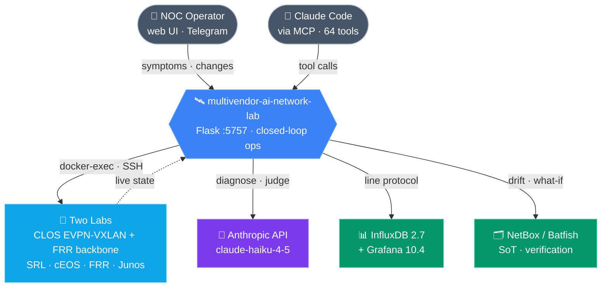
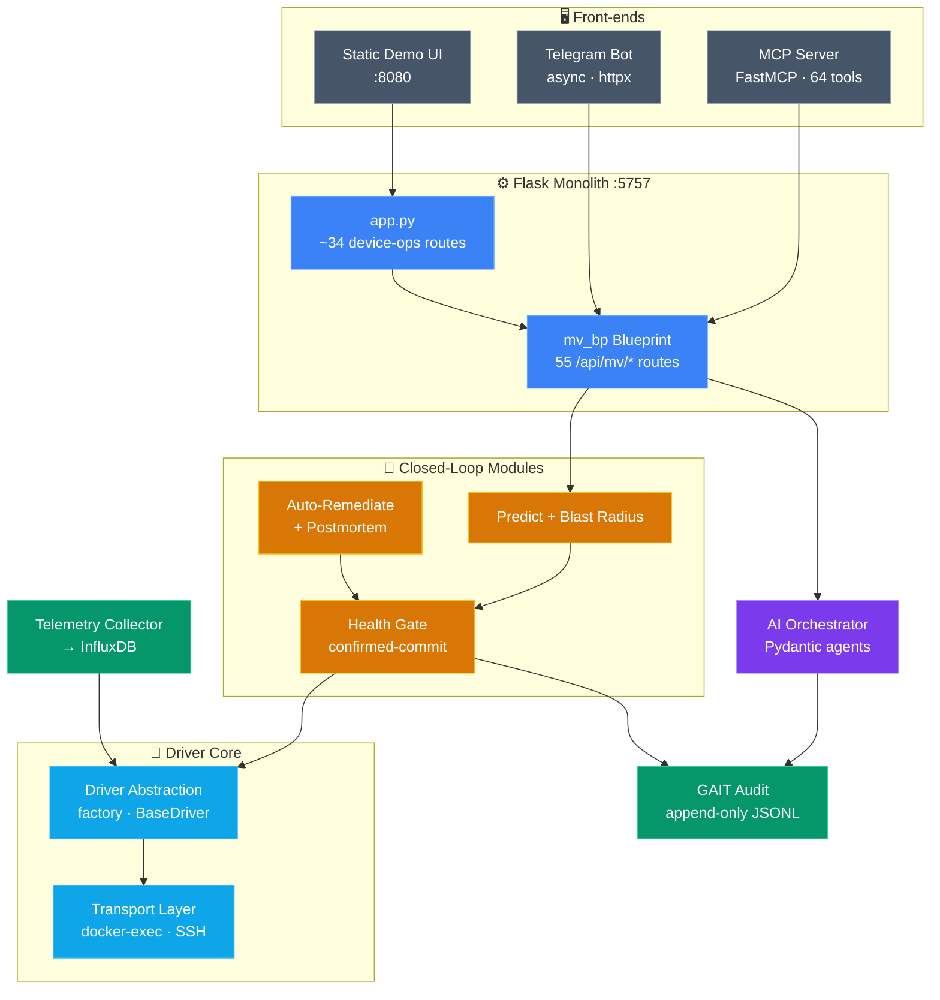
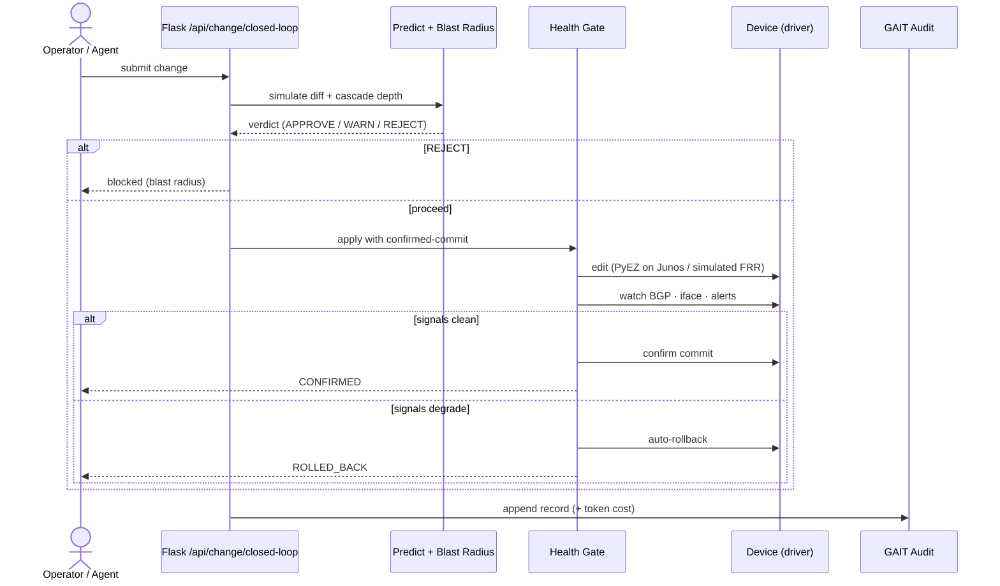
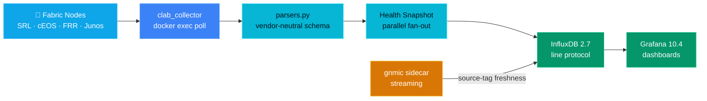
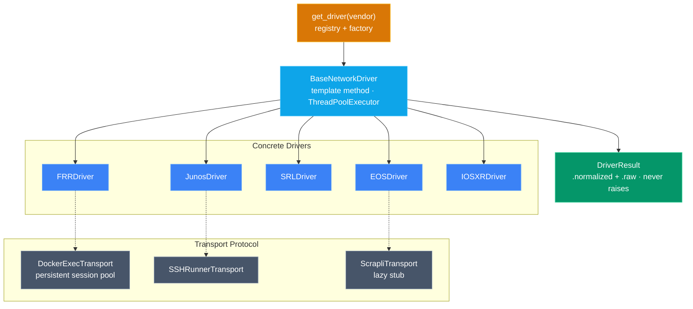
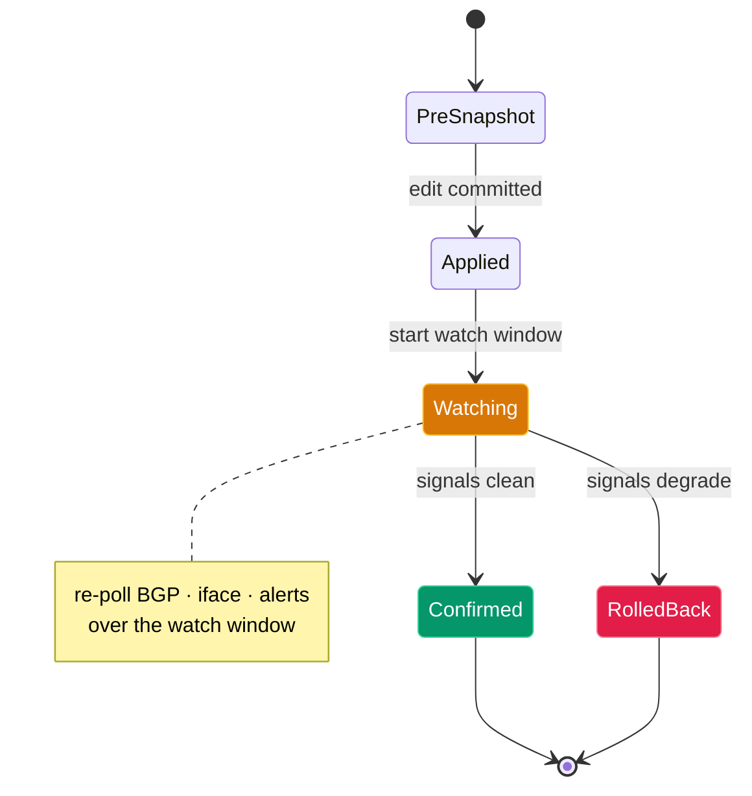

# 🏛️ multivendor-ai-network-lab — Architecture

A closed-loop, multi-vendor network operations lab. Two real labs — a
containerlab CLOS EVPN-VXLAN fabric (Nokia SR Linux / Arista cEOS / FRR) and a
docker-compose FRR multi-region backbone — are driven by a Flask monolith on
`:5757` whose core is a **vendor-neutral driver abstraction layer** that collects
live state over docker-exec/SSH and normalizes it. On top sit an AI multi-agent
orchestrator, a governed closed-loop change pipeline
(**Predict → Blast Radius → Health Gate confirmed-commit → Watch → Verify** with
auto-rollback), event-initiated auto-remediation, auto-postmortems, an immutable
**GAIT** audit trail, and InfluxDB/Grafana telemetry. The whole surface is exposed
to AI agents through a **64-tool MCP server** and to humans through a Telegram bot
and a static demo UI.

## Table of Contents

1. [System Context](#1-system-context)
2. [Container & Component Map](#2-container--component-map)
3. [Closed-Loop Change Pipeline (sequence)](#3-closed-loop-change-pipeline-sequence)
4. [Telemetry Data Flow](#4-telemetry-data-flow)
5. [Driver Abstraction (class map)](#5-driver-abstraction-class-map)
6. [Health Gate State Machine](#6-health-gate-state-machine)
7. [Tech Stack](#tech-stack)

---

## 1. System Context

The lab sits between humans (NOC operators on the web UI / Telegram) and AI
agents (Claude Code over MCP), driving two physical labs and emitting telemetry
to observability backends while calling the Anthropic API for diagnosis.

---

## 2. Container & Component Map

Inside the Flask monolith, every request resolves a device, picks a vendor
driver, and runs commands through a transport; the closed-loop, AI, and audit
modules layer on top of that single driver core.

---

## 3. Closed-Loop Change Pipeline (sequence)

A governed change is gated three ways before it touches a device, then watched
during a confirmed-commit window — clean signals confirm, degraded signals
trigger automatic rollback, and every step is appended to the GAIT ledger.

---

## 4. Telemetry Data Flow

Raw CLI from every node is normalized by the shared driver package into a
vendor-neutral schema, fanned out in parallel into a health snapshot, and
written as InfluxDB line protocol for Grafana — with a gnmic streaming sidecar
feeding the same bucket.

---

## 5. Driver Abstraction (class map)

`BaseNetworkDriver` is a template method that runs per-section commands with
fallback and a parallel health fan-out; `get_driver()` maps a canonical vendor
to a concrete subclass and auto-selects a transport that implements a common
Protocol. Every call returns a soft-failing `DriverResult`.

---

## 6. Health Gate State Machine

The Health Gate models a change as a confirmed-commit lifecycle: snapshot,
apply, watch, then either confirm or roll back — the same machine that
auto-remediation runs its fixes through.

---

## Tech Stack

| Layer | Technologies |
|---|---|
| **Network labs** | containerlab · docker-compose · Nokia SR Linux · Arista cEOS · FRR · Junos (cRPD/vJunos) |
| **Driver core** | Python ABC · dataclasses · `concurrent.futures` · registry/factory · `typing.Protocol` |
| **Transport** | subprocess (arg-list, no `shell=True`) · persistent docker-exec session pool · SSH |
| **API** | Flask · Flask Blueprints · gunicorn |
| **Closed loop** | junos-eznc (PyEZ confirmed-commit) · optional Batfish digital twin |
| **AI** | Anthropic SDK (`claude-haiku-4-5`) · Pydantic · JSON-mode prompting · LLM-as-judge eval |
| **Audit** | append-only JSONL · threading lock · date-rotated GAIT ledger |
| **Telemetry** | InfluxDB 2.7 line protocol · Grafana 10.4 · gnmic streaming sidecar |
| **Agent / human surfaces** | FastMCP (64 tools) · python-telegram-bot v20+ · httpx · launchd |

---

Generated architecture documentation · diagrams render natively on GitHub (Mermaid + animated SVG).

